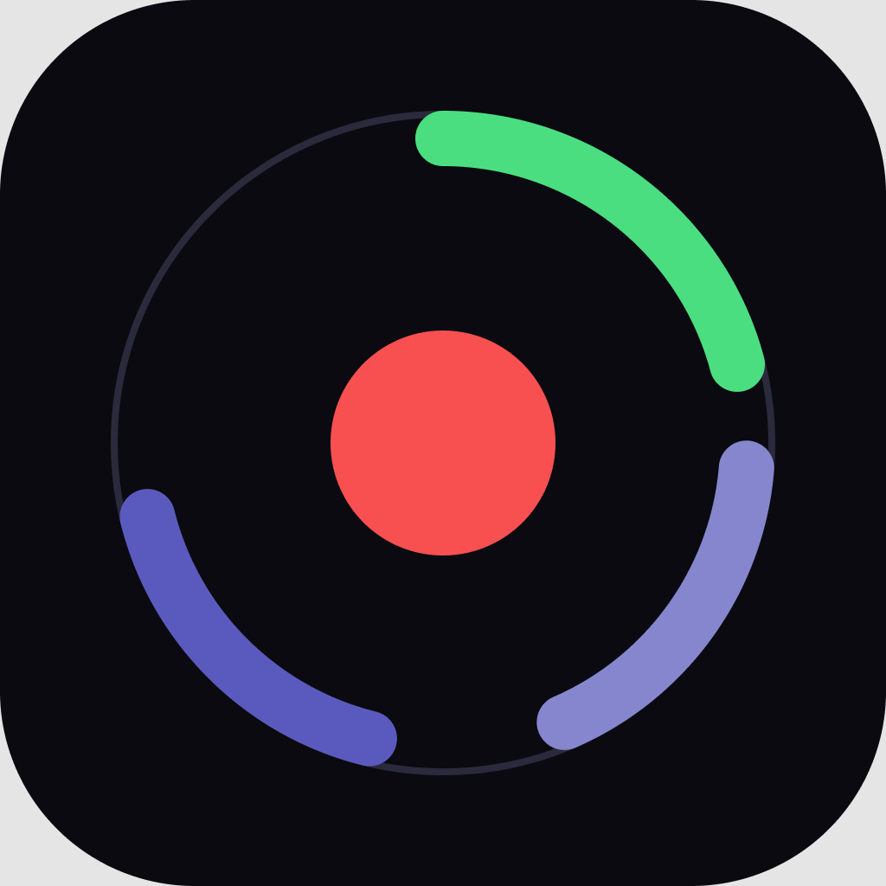

# PolyRec

Multi-track screen recorder for Windows.

<br clear="left" />

## Download / Installation

Grab the latest release from the [Releases page](https://github.com/yusukensanta/polyrec/releases/latest) — two options are published for every version:

- **`polyrec-vX.Y.Z-windows-x64-setup.exe`** — a normal installer. Double-click, click through the wizard, get a Start Menu shortcut and an Add/Remove Programs entry. Recommended if you just want to install it like any other app.
- **`polyrec-vX.Y.Z-windows-x64.zip`** — portable, no installer: unzip and run `polyrec.exe` directly. Nothing is written outside the folder you unzip it to.

Either way, the app checks for newer releases on launch and shows a banner in the menu bar if one's available (click it to open the release page; nothing downloads or installs automatically).

The installer is unsigned (no code-signing certificate), so Windows SmartScreen will show an "Unknown Publisher" warning on first run — click **More info → Run anyway**. See [SECURITY.md](SECURITY.md) for why, and the verification steps below if you want independent confirmation of what you're running instead of just trusting the warning-click.

### Verifying a download (optional)

Each release includes a `SHA256SUMS.txt` and a build provenance attestation covering both the installer and the zip, so you don't have to just trust that the file on the release page is what CI actually built.

Checksum (PowerShell):

```powershell
Get-FileHash polyrec-vX.Y.Z-windows-x64-setup.exe -Algorithm SHA256
# compare the output against the matching line in SHA256SUMS.txt
```

Build provenance (requires the [GitHub CLI](https://cli.github.com/)) — confirms the file was built by this repo's release workflow from the tagged commit, not just that the bytes match a checksum someone could have regenerated alongside a swapped file:

```powershell
gh attestation verify polyrec-vX.Y.Z-windows-x64-setup.exe -R yusukensanta/polyrec
```

Releases are also immutable once published — assets can't be silently replaced after the fact; any change requires deleting and recreating the release entirely.

## Features

- **Window capture** via Windows.Graphics.Capture — pick any visible window. Recording defaults to that window's own native resolution; "Match display" and "Custom" are opt-in alternatives in **⚙ Quality**.
- **Multi-track audio** — record system loopback (Speakers) and microphone as independent tracks. Loopback is selected by default so the common case is one clean, unambiguous track; check Microphone to add a second.
- **App audio only** — scope loopback capture to just the selected app's process via the Windows Process Loopback Capture API, instead of the full desktop mix.
- **Pause / resume** without cutting the recording.
- **Global hotkeys** — start/stop, pause, and toggle the on-screen overlay from anywhere, rebindable from the in-app **⌨ Hotkeys** popup (F9 / F8 / F7 by default). Pressing start/stop while some other window has focus records *that* window, not whatever's selected in the list.
- **Quality settings** (**⚙ Quality**) — FPS (30/60), codec (H265 with automatic fallback to H264 if your machine lacks an HEVC encoder, or H264 directly), resolution mode, and bitrate (auto-calculated from resolution×fps, or a manual Mbps override).
- **Export** — remux the recording with only the audio tracks you want, no re-encoding.
- **Update check** — compares your version against the latest GitHub release on launch; no auto-download.

## Requirements

- Windows 10 2004+ (build 19041+) — required for the Process Loopback Capture API used by "app audio only".
- A GPU with Direct3D 11 support.

## Build

```powershell
cargo build --release
```

The built binary is at `target/release/polyrec.exe`, with the app icon embedded via `build.rs`.

## Usage

1. Pick a capture source from the list on the left.
2. Choose which audio tracks to include (Speakers / Microphone), and optionally check **App audio only** to isolate the selected app's sound.
3. Adjust **⚙ Quality** or **⌨ Hotkeys** if you want something other than the defaults.
4. Press **REC** (or the start/stop hotkey) to start, pause hotkey to pause/resume, start/stop hotkey again to stop.
5. On stop, export lets you pick which audio tracks to keep in the final file.

Recordings are saved to `<output folder>/polyrec/<app name>_<finish time>.mp4` — the output folder defaults to your Videos folder and is configurable from the app.

## Releasing (maintainers)

Push a tag matching `v*.*.*` (e.g. `v0.2.0`) after bumping `Cargo.toml`'s `version` to match — CI builds, verifies the tag matches Cargo.toml, and publishes a release zip automatically. See `.github/workflows/release.yml`.

The workflow also generates `SHA256SUMS.txt` and a build provenance attestation ([`actions/attest-build-provenance`](https://github.com/actions/attest-build-provenance)) for the zip, so a compromised upload credential replacing a release asset after the fact is both harder (releases are immutable — see repo settings) and detectable (the checksum/attestation are recorded independently of the release itself, in the workflow log and Sigstore's transparency log respectively).

## Contributing

See [CONTRIBUTING.md](CONTRIBUTING.md) for build/test setup, project structure, and the PR process. Notable changes are tracked in [CHANGELOG.md](CHANGELOG.md).

## Security

See [SECURITY.md](SECURITY.md) for the supported-versions policy and how to report a vulnerability.

## License

Apache-2.0 — see [LICENSE](LICENSE).
